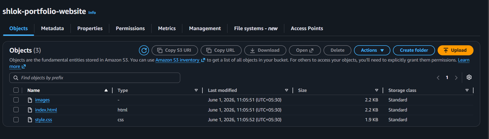
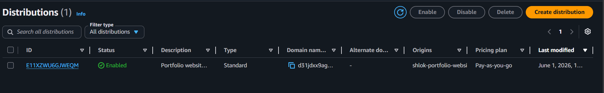

# AWS Static Website Hosting

A cloud project demonstrating static website deployment using AWS services.

## Technologies Used

* Amazon S3
* Amazon CloudFront
* HTML
* CSS
* Git & GitHub

## Features

* Responsive portfolio website
* Hosted on Amazon S3
* Delivered globally using CloudFront CDN
* HTTPS-enabled access
* Cloud-based deployment

## Project Architecture

User → CloudFront → S3 Static Website

## Learning Outcomes

* Static website hosting on AWS
* Content Delivery Networks (CDN)
* Cloud deployment workflows
* Website security and HTTPS
* GitHub version control
## Screenshots

### Portfolio Homepage

### S3 Static Website Hosting

### CloudFront Distribution

### Live Website

## Author

Shlok Singh
